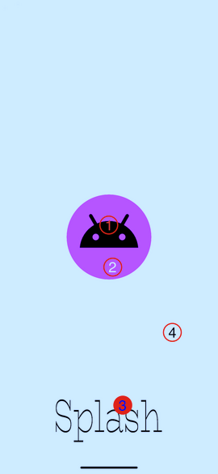
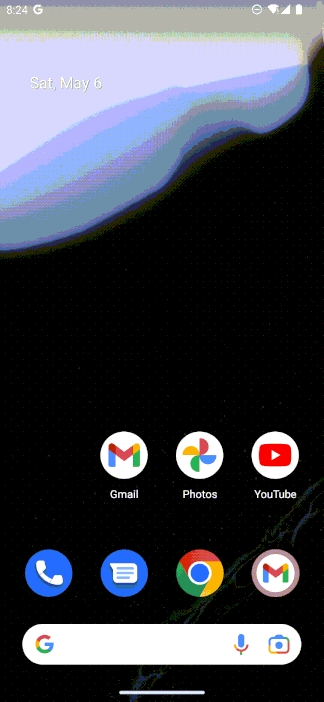

# AnimatedSplashScreen

This project contains integration of animated splash screen in most easiest way.

Starting from Android 12, android changed it's splash animation integration process. According to the doc, now 4 elements forsplash screen can be defined in them: 
1. An icon at the center (`windowSplashScreenAnimatedIcon`)
2. Icon background color (`windowSplashScreenIconBackgroundColor`)
3. Brand image (`windowSplashScreenBrandingImage`)
4. Page background color (`windowSplashScreenBackground`)



Animated icons are also supported here in the element 1. But animation should be defined in an [AnimationDrawable](https://developer.android.com/reference/android/graphics/drawable/AnimationDrawable) file.In this project's [drawable folder](https://github.com/shafayathossain/AnimatedSplashScreen/tree/main/app/src/main/res/drawable), images for each frames of the animated icon can be found. All of these frames image are defined in the [splash_icon.xml](https://github.com/shafayathossain/AnimatedSplashScreen/blob/main/app/src/main/res/drawable/splash_icon.xml) file. Then set this `splash_icon` as the icon in splash.

If your animation takes longer than 1000ms then it may not appear. Standard splash animated icon shouldn't take longer than 166ms. But if longer time is required in splash, then `setKeepOnScreenCondition` needs to be override.
In the landing activity call `installSplashScreen()` using [SplashScreen](https://developer.android.com/reference/kotlin/androidx/core/splashscreen/SplashScreen#(android.app.Activity)) library to get the splash screen instance. Then set screen condition by `setKeepOnScreenCondition` and return false until data is ready or a fixed duration. For a fixed delay, timer can also be run. For example, following code will show splash for 1200ms.

```
import androidx.core.splashscreen.SplashScreen.Companion.installSplashScreen

class MainActivity : ComponentActivity() {
    private var keepSplash = true
    private val delay = 1200L
    override fun onCreate(savedInstanceState: Bundle?) {
    
        val splashScreen = installSplashScreen()
        setupSplashScreen(splashScreen = splashScreen)
        
        super.onCreate(savedInstanceState)
        
        // REST OF THE CODE
        
    }
    
    private fun setupSplashScreen(splashScreen: SplashScreen) {
        // Replace this timer with your logic to load data on the splash screen.
        splashScreen.setKeepOnScreenCondition { keepSplash }
        Handler(Looper.getMainLooper()).postDelayed({
            keepSplash = false
        }, delay)
    }
}
```

### Demo


This is the most easiest way to show some animation in splash.

### References
- [Splash screen doc](https://developer.android.com/develop/ui/views/launch/splash-screen)
- [Splash Screen Tutorial from Kodeco](https://www.kodeco.com/32555180-splash-screen-tutorial-for-android)
- [Answer for Android 12 Splash Screen API - Increasing SplashScreen Duration](https://stackoverflow.com/a/70857275)
